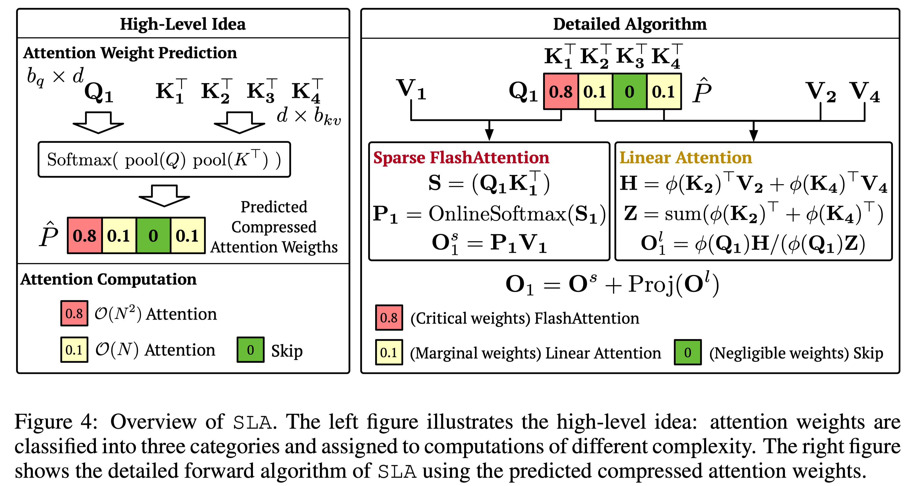
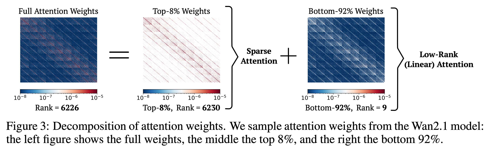
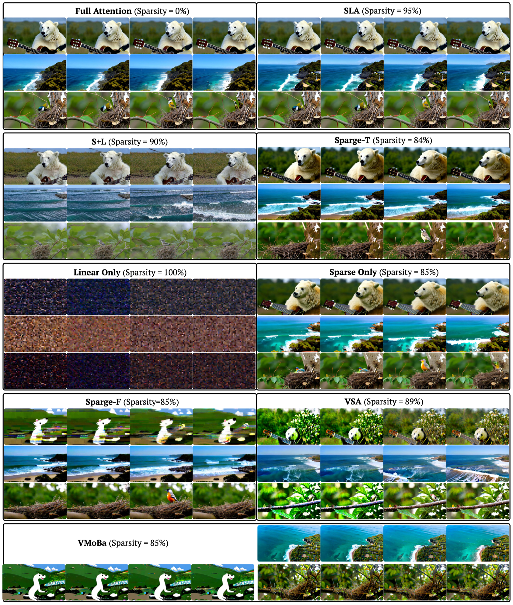
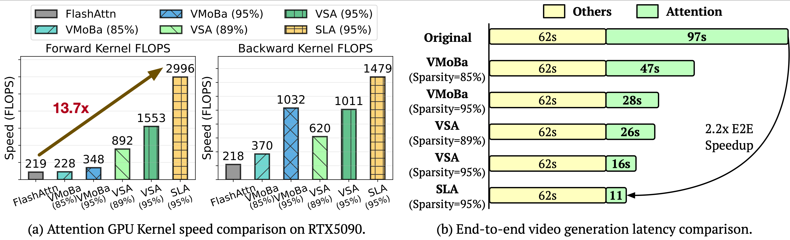

# SLA
This repository provides the implementation of [SLA](https://www.arxiv.org/pdf/2509.24006) (Sparse–Linear Attention), a trainable attention method that fuses sparse and linear attention to accelerate diffusion models.

SLA: Beyond Sparsity in Diffusion Transformers via Fine-Tunable Sparse–Linear Attention  
*Jintao Zhang, Haoxu Wang, Kai Jiang, Shuo Yang, Kaiwen Zheng, Haocheng Xi, Ziteng Wang, Hongzhou Zhu, Min Zhao, Ion Stoica, Joseph E. Gonzalez, Jianfei Chen, Jun Zhu*  
Paper: https://www.arxiv.org/pdf/2509.24006  

We provide two versions of SLA: you can use either the [SLA-1 branch](https://github.com/thu-ml/SLA/tree/SLA-1) or the [main branch](https://github.com/thu-ml/SLA).




### Motivation


### Effectiveness


### Efficiency



### Installation

```bash
git clone https://github.com/thu-ml/SLA.git
cd SLA
pip install -e .
```

### Usage

```python
import torch
from sparse_linear_attention import SparseLinearAttention

attn = SparseLinearAttention(
    head_dim=128,
    topk=0.2,                 # = 1 - sparsity
    feature_map="softmax",    # options: elu, relu, softmax
    BLKQ=64,
    BLKK=64,
).cuda()

B, H, L, D = 2, 4, 4096, 128
q = torch.randn((B, H, L, D), dtype=torch.bfloat16, device='cuda')
k = torch.randn((B, H, L, D), dtype=torch.bfloat16, device='cuda')
v = torch.randn((B, H, L, D), dtype=torch.bfloat16, device='cuda')

o = attn(q, k, v)
```

### SageSLA

We provide **SageSLA**, a very fast SLA (Sparse-Linear Attention) forward pass based on [SageAttention](https://github.com/thu-ml/SageAttention). It uses some code from [SpargeAttn](https://github.com/thu-ml/SpargeAttn). Please refer to the `SageSLA/` directory for the usage of SageSLA.

## Citation

If you find this work useful, please cite:

```bibtex
@article{zhang2025sla,
  title={SLA: Beyond Sparsity in Diffusion Transformers via Fine-Tunable Sparse-Linear Attention},
  author={Zhang, Jintao and Wang, Haoxu and Jiang, Kai and Yang, Shuo and Zheng, Kaiwen and Xi, Haocheng and Wang, Ziteng and Zhu, Hongzhou and Zhao, Min and Stoica, Ion and others},
  journal={arXiv preprint arXiv:2509.24006},
  year={2025}
}

@article{zhang2026sla2,
  title={SLA2: Sparse-Linear Attention with Learnable Routing and QAT},
  author={Zhang, Jintao and Wang, Haoxu and Jiang, Kai and Zheng, Kaiwen and Jiang, Youhe and Stoica, Ion and Chen, Jianfei and Zhu, Jun and Gonzalez, Joseph E},
  journal={arXiv preprint arXiv:2602.12675},
  year={2026}
}

@inproceedings{zhang2025sageattention,
  title={SageAttention: Accurate 8-Bit Attention for Plug-and-play Inference Acceleration}, 
  author={Zhang, Jintao and Wei, Jia and Zhang, Pengle and Zhu, Jun and Chen, Jianfei},
  booktitle={International Conference on Learning Representations (ICLR)},
  year={2025}
}
```
